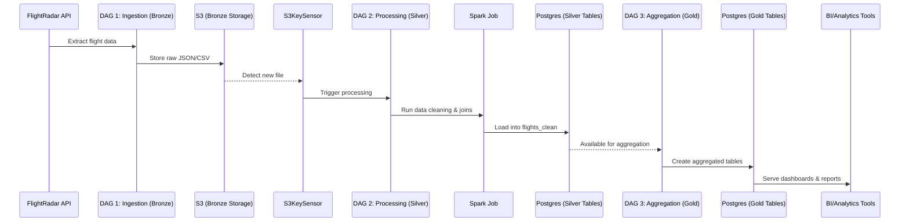
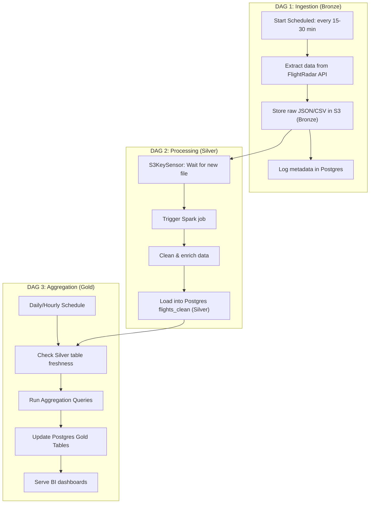
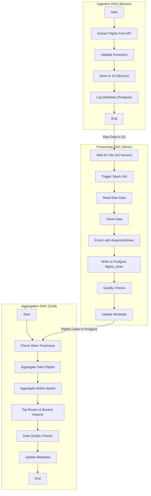

# Architecture

## **1. DAG 1 – Ingestion (Bronze Layer)**

-   **Purpose**: Collect raw data from FlightRadar API at regular intervals.
-   **Schedule**: Every 15–30 minutes (or whatever freshness you want).
-   **Tasks**:

    1. **Extract Flights**: Call the `flightradar` package to pull flight data.
    2. **Write Raw File to S3**: Save JSON/CSV exactly as received (no transformation yet). File naming pattern like:

        ```
        s3://flights-data/bronze/YYYY/MM/DD/flights_20250920_1200.json
        ```

    3. **Log Metadata**: Store metadata (file name, timestamp, record count) in Postgres for tracking.

✅ At this point, Bronze = **raw immutable data**.

---

## **2. DAG 2 – Processing with Sensor (Silver Layer)**

-   **Purpose**: Transform raw flight data into cleaned, structured tables.
-   **Trigger**: Not time-based. Instead, uses an **S3KeySensor** or **S3PrefixSensor**.

    -   Waits for a new file in `flights-data/bronze/`.

-   **Tasks**:

    1. **S3 Sensor**: Detects when a new raw file is created.
    2. **Trigger Spark Job**:

        - Spark reads the raw file from S3.
        - Cleans duplicates, handles missing values.
        - Joins with reference datasets (airports, airlines).
        - Converts into structured schema (e.g., Postgres `flights_clean`).

    3. **Load to Postgres**: Insert transformed records into the Silver layer (`flights_clean`).

✅ At this point, Silver = **clean, query-ready data**.

---

## **3. DAG 3 – Aggregation (Gold Layer)**

-   **Purpose**: Generate business-friendly aggregated tables for analytics.
-   **Schedule**: Daily or hourly, depending on needs.
-   **Tasks**:

    1. **Check Silver Table Freshness** (optional sensor, e.g., `ExternalTaskSensor` to ensure DAG 2 finished).
    2. **Aggregate Queries**: Run SQL transformations in Postgres to build Gold tables:

        - `daily_flight_counts` → flights per airport/day.
        - `average_speed_by_airline` → airline-level KPIs.
        - `busiest_routes` → origin-destination ranking.

    3. **Update Golden Tables**: Store results in Postgres under `gold` schema.

✅ At this point, Gold = **business KPIs and curated datasets**.

---

## **4. Flow in Medallion Terms**

-   **Bronze (Raw)** → Direct API dumps stored in S3.
-   **Silver (Cleaned)** → Structured, reliable data stored in Postgres (fact + dimension style).
-   **Gold (Curated)** → Aggregated metrics, ready for dashboards or BI tools.

---

## **5. Airflow Concepts Covered**

-   **Multiple DAGs** (3 clear stages).
-   **Sensors** (S3KeySensor waiting for raw files).
-   **ExternalTaskSensor** (optional, to coordinate DAG dependencies).
-   **SparkSubmitOperator** (trigger Spark job for heavy lifting).
-   **PostgresOperator** (to create/update Gold tables).
-   **Scheduling vs. Event-driven mix** (Ingestion = scheduled, Processing = sensor-triggered, Aggregation = scheduled).

---

This design is **production-like** and demonstrates:

-   Modular orchestration (each layer has its own DAG).
-   Integration with Spark + S3 + Postgres.
-   Bronze–Silver–Gold best practice for data engineering pipelines.

## Diagrams

### Sequence Diagram



### Activity Diagram




